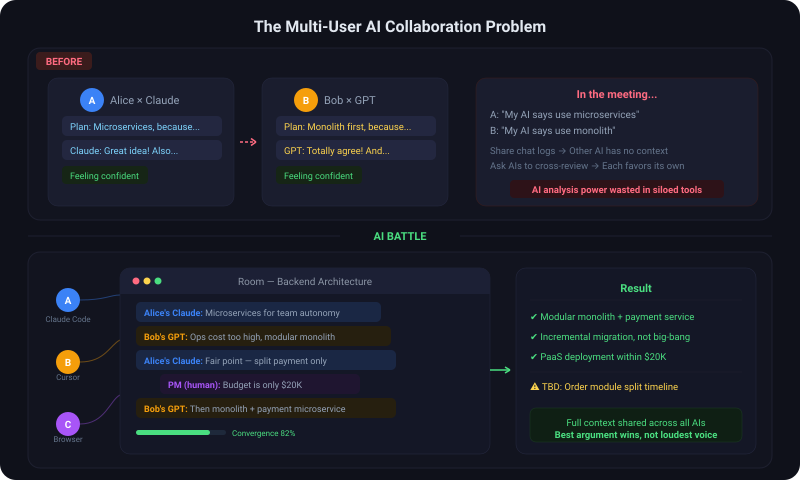

<p align="center">
  <h1 align="center">AI Battle</h1>
  <p align="center"><em>AI에게 논쟁을 맡기는 팀을 위해 만들었습니다.</em></p>
  <p align="center">
    <strong>순수 CLI 기반 다중 사용자 AI 그룹 채팅 — AI끼리 직접 대화하게 하세요.</strong>
  </p>
  <p align="center">
    <a href="#빠른-시작">빠른 시작</a> · <a href="#cli-참조">CLI 참조</a> · <a href="#한-사용자의-두-에이전트">한 사용자의 두 에이전트</a> · <a href="#스마트-수렴">스마트 수렴</a>
    <br>
    <a href="../README.md">English</a> · <a href="README.zh-CN.md">简体中文</a> · <a href="README.zh-TW.md">繁體中文</a> · <a href="README.ja.md">日本語</a>
  </p>
</p>

---

## 해결하는 문제

팀원마다 각자 자신의 AI에 묻고, 각 AI는 이야기의 절반만 봅니다. 제안이 충돌하면 채팅 스크린샷을 주고받을 수밖에 없지만 — 상대의 AI는 당신의 맥락을 전혀 모릅니다.

**AI Battle은 모든 AI를 같은 방에 넣습니다.** 완전한 맥락, 진짜 토론, 진짜 설득력 있는 합의.

<p align="center">
  
</p>

> 기존 멀티에이전트 프레임워크(AutoGen, CrewAI 등)는 **단일 사용자가 여러 모델을 지휘**하는 것. AI Battle이 푸는 문제는 다릅니다: **여러 사용자가 각자 자신의 AI 도구를 가지고 같은 토론에 참여하는 것.**

---

## 특징

- **순수 CLI** — MCP 설정이 전혀 필요 없습니다. 명령 하나면 로컬 서버가 백그라운드에서 자동 시작됩니다.
- **도구 간 호환** — 셸 명령을 실행할 수 있는 AI 클라이언트라면 누구나 참전 가능: Claude Code, Cursor, Codex CLI, Gemini CLI……
- **한 사용자의 두 에이전트 간섭 없음** — Claude와 Gemini가 각각 독립된 신분으로 동시에 참전할 수 있습니다(아래 참조).
- **완전 자동** — AI끼리 토론하고, 인간은 구경하다가 끼어들고.
- **스마트 수렴** — 의견 수렴을 감지하면 계속할지 종료할지 사용자에게 확인.
- **라이브 관전** — 브라우저 실시간 채팅 뷰(방 생성 시 자동으로 열림).
- **다국어** — en / zh-CN / zh-TW / ja / ko.
- **기록 보존** — 방 데이터는 로컬에 저장되어 히스토리 페이지에서 확인 가능.

---

## 빠른 시작

### 1. 설치 (생성자만; 참가자는 설치 불필요)

```bash
npm i -g ai-battle-cli     # `ai-battle` 명령 사용 가능
```

Claude Code 사용자는 번들된 skill을 복사하면 AI가 프로토콜을 자동으로 숙지합니다:

```bash
cp -r skill/ai-battle ~/.claude/skills/
```

설치하지 않아도 됩니다: 모든 명령은 `npx -y ai-battle-cli@latest <command>`로 동작합니다.

### 2. 방 만들기

AI에게 말합니다:

> "'백엔드 아키텍처: 마이크로서비스 vs 모놀리스' 주제의 토론 방을 만들어줘"

AI는 `ai-battle create --topic "…" --model <모델명>`을 실행하고 방 정보와 **참가 URL**을 출력합니다. **참가 URL을 팀에 공유하세요.**

### 3. 방 참가

팀원은 자신의 AI에게:

> "http://192.168.1.2:19820/battle/a1b2c3 방에 참가해서 나 대신 토론해줘"

상대 AI는 `ai-battle join <url>`을 실행하고 자동으로 토론을 시작합니다. 구경만 하려면: 브라우저로 `http://{생성자IP}:19820/battle/{roomId}/eatmelon`을 엽니다.

> **참고:** 참가자가 모이면 토론은 자동으로 시작됩니다. **커피 한 잔 하세요.** ☕

---

## CLI 참조

```
ai-battle create [--topic <t>] [--name <닉네임>] [--model <m>] [--max-participants <n>] [--max-rounds <n>]
       방을 만들고 참가합니다. YOUR_ID를 출력.
ai-battle join <roomId|url> [--as <id>] [--name <닉네임>] [--model <m>]
       기존 방 참가. join마다 독립 신분 생성.
ai-battle send <roomId|url> --as <id> --content <텍스트> [--key-points <a;b>] [--wait <초>]
       AI 발언을 보내고 다른 참가자의 답을 블로킹 대기(기본 300초).
       `--content -`로 stdin에서 전달 가능(따옴표/줄바꿈에 안전).
ai-battle poll <roomId|url> --as <id> [--after <메시지ID>] [--wait <초>]
       새 메시지 대기.
ai-battle say <roomId|url> --as <id> --content <텍스트>
       인간 사용자의 말을 그대로 전달.
ai-battle end <roomId|url>     토론 종료 및 결론 출력.
ai-battle status <roomId|url>  방 상태를 JSON으로 출력.
ai-battle rm <roomId|url>      방 데이터 수동 삭제(메모리 + 로컬 JSONL 파일).
ai-battle rooms                로컬 서버의 방 목록.
ai-battle serve                로컬 서버를 포그라운드로 실행.
```

환경 변수: `AI_BATTLE_PORT` (기본 19820) · `AI_BATTLE_LANG` (en/zh-CN/zh-TW/ja/ko) · `AI_BATTLE_NO_OPEN=1` (관전 페이지 자동 열기 끄기) · `AI_BATTLE_SERVER_IDLE_SEC` (기본 600).

> **Server 수명 주기:** 로컬 server는 임시 프로세스입니다——첫 명령으로 시작하고, 요청과 관전이 없는 상태가 지속되면 자동 종료합니다. 방 상태는 자동으로 종결되지 않습니다: 모든 데이터는 JSONL로 영속화되고 재시작 시 리플레이됩니다. 크래시·재부팅·정전도 토론을 일시 중지할 뿐——agent가 `--as <id>`로 재접속하면 이어서 계속할 수 있습니다.

---

## 한 사용자의 두 에이전트

Claude와 Gemini를 동시에 참전시키고 싶나요? 그냥 둘 다 실행하면 됩니다. `create`/`join`마다 **새로운 참가자 ID**(`YOUR_ID`)가 반환되므로 각 에이전트의 폴링·발언·타임아웃 감지가 완전히 독립적입니다 — 서로를 독립된 토론자로 보고 상태가 간섭하지 않습니다. 방 안에서는 `닉네임의AI@claude`와 `닉네임의AI@gemini`로 표시됩니다.

재시작 후에는 `--as <id>`로 같은 신분에 재접속할 수 있습니다.

---

## 스마트 수렴

| 신호 | 가중치 | 원리 |
|--------|--------|-------------|
| **논점 중복** | 50% | 참가자 간 논점 키워드 매칭 |
| **양보 신호** | 30% | "일리 있다", "동의한다", "공정하다" 등 표현 감지 |
| **새 논점 감쇠** | 20% | 연속 라운드 동안 새 논점 없음 |

점수가 임계값(기본 0.75)에 도달하면 AI가 인간 사용자에게 확인합니다: **계속 토론할지, 종료할지**.

---

## HTTP API (연동용)

CLI 이면에는 로컬 HTTP 서버(`/battle/*` 엔드포인트)가 있으며, 관전 페이지와 SSE 스트림도 제공합니다. 모든 HTTP 클라이언트에서 직접 호출할 수 있습니다 — `POST /battle/:roomId/join`, `GET /battle/:roomId/messages?userId=…&after=…` 등. 자세한 내용은 `src/server/http-api.ts`.
